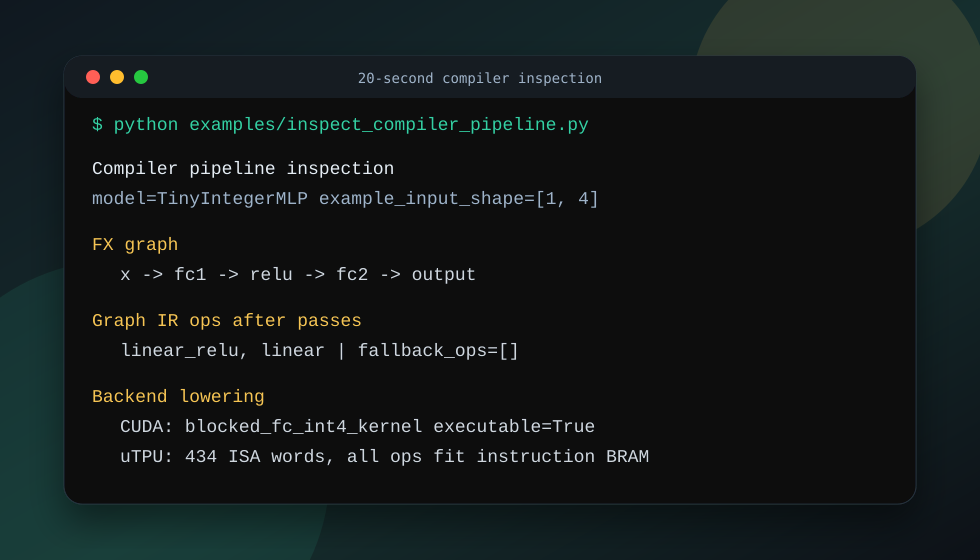

# uTPU: Scoped ML Compiler + CUDA/uTPU Backend Lab

[](https://github.com/gentialiaj411/uTPU/actions/workflows/ci.yml)



For a full top-down tour and interview prep, see [WALKTHROUGH.md](WALKTHROUGH.md).

`uTPU` is a focused ML systems project: PyTorch models lower into a custom Graph IR, then into generated CUDA kernels and/or custom uTPU ISA/RTL programs. The point is not broad framework coverage. The point is compiler passes, backend lowering, measurement discipline, autotuning, and hardware-style verification on narrow, explicit workload families.

## Scope

Supported:

- Batch-1 MLP-style `Linear -> ReLU -> Linear` flows.
- Single-block transformer path: `Q/K/V linear -> attention -> output projection -> residual -> RMSNorm -> (optional MLP reuse)`.
- Pass-based Graph IR: shape inference, Linear+ReLU fusion, dead-code elimination, liveness memory planning, backend legality.
- Transformer pass pipeline: attention decomposition (`scaled_dot_product_attention` -> `permute + batched_matmul + scale + softmax + batched_matmul`) plus `scale+softmax` fusion.
- INT4 blocked fully connected lowering for CUDA and uTPU program emission.
- CUDA runtime execution through generated NVRTC kernels.
- uTPU ISA generation plus Python ISA simulation and Verilog RTL simulation evidence.
- `torch.compile` custom backend (`backend="utpu"`) that dispatches supported FX subgraphs through the existing CUDA / uTPU ISA pipeline and falls back to eager for unsupported ops.
- **ResNet-18 (CUDA graph path):** FX import for `Conv2d`, `BatchNorm2d` (folded into conv), `MaxPool2d`, `AdaptiveAvgPool2d`, residual `add`, and `Linear`; end-to-end compile + execution through the Graph IR runtime. Evidence: [bench/results/real_model_end_to_end.json](bench/results/real_model_end_to_end.json), `firmware/host/test_real_model_end_to_end.py`.

Not claimed:

- General PyTorch compiler support beyond the documented families (blocked-FC MLP, transformer blocks, ResNet-18 on CUDA).
- Full GPT/BERT graph coverage.
- Production `torch.compile` backend.
- End-to-end speedup over PyTorch/cuBLAS on tiny benchmarks.

## Evidence-Backed Claims

- Compiler correctness: differential harness compares the NumPy Graph IR interpreter, CUDA compiled backend, uTPU quantized emulation, and a TorchInductor oracle when the local platform supports it. Evidence: [docs/EVIDENCE.md#differential-testing](docs/EVIDENCE.md#differential-testing), [firmware/host/differential_test_harness.py](firmware/host/differential_test_harness.py).

- Real-model CUDA path: ResNet-18 lowers end-to-end through FX → Graph IR → graph-op execution (NVRTC kernels when `cuda-python` is available; otherwise Torch-CUDA or NumPy reference fallback as recorded in the artifact). Parity vs eager PyTorch is checked at `rtol=1e-3`, `atol=1e-3`. Evidence: [bench/results/real_model_end_to_end.json](bench/results/real_model_end_to_end.json).

- CUDA performance engineering: calibrated CUDA-event data backs a schedule-aware analytical cost model and pruning policy for blocked-FC autotuning. The current measured-data replay profiles `4.92` of 16 schedules on average (`3.25x` search reduction), keeps every selected schedule within `1%` of exhaustive best, and lowers max replay regression from strict top-k's `5.90%` to `0.49%`. A small live CUDA smoke check also exercises exhaustive vs pruned tuning, but replay remains the primary quality claim. Evidence: [docs/EVIDENCE.md#cost-model-and-pruned-autotuner](docs/EVIDENCE.md#cost-model-and-pruned-autotuner), [firmware/host/cost_model.py](firmware/host/cost_model.py), [firmware/host/cuda_autotuner.py](firmware/host/cuda_autotuner.py).

- Hardware verification: Python ISA simulator and Verilog RTL produce bit-identical fetch bytes on two compiled fused MLP programs. Evidence: [docs/EVIDENCE.md#python-isa-simulator--rtl-bitmatch](docs/EVIDENCE.md#python-isa-simulator--rtl-bitmatch), [firmware/host/isa_simulator.py](firmware/host/isa_simulator.py), [rtl/tb/tb_fused_compressed_program.sv](rtl/tb/tb_fused_compressed_program.sv).

- Hardware validation in the published repo is simulation-based: Python ISA simulation, Verilog RTL simulation, and explicit board-fit audits. On-board FPGA execution evidence is not published in-repo yet. Evidence: [docs/EVIDENCE.md](docs/EVIDENCE.md).

- Cost-model **generalization on unseen shapes**: deterministic 80/20 train-test split partitioned by `(in_features, out_features)`; refit on TRAIN only, evaluated on 5 unseen TEST shapes. Held-out `log_R^2 = 0.926` (test/train ratio `0.995`), held-out `MAPE = 14.32%`, held-out selection-regret mean `5.21%` / max `11.90%`, within-10% `0.80`. Top-1 prediction is **not** claimed on unseen shapes; the supported claim is bounded regret. Evidence: [bench/results/cost_model_heldout.json](bench/results/cost_model_heldout.json), [firmware/host/run_cost_model_heldout.py](firmware/host/run_cost_model_heldout.py), [firmware/host/test_cost_model_heldout.py](firmware/host/test_cost_model_heldout.py).

- Board-fit audit (Phase 7 remediation P3): the project no longer silently overflows the instruction BRAM. `bench/results/board_fit_audit.json` reports, for each of three reference RTL configurations (`pynqz2_baseline` `PROG_DEPTH=1024` shipping bitstream / `pynqz2_bram_max` `PROG_DEPTH=8192` synthesis bump / `vu13p_uram` `PROG_DEPTH=131072` URAM-class part), exactly which workloads fit. Today's bitstream admits `16x16`, `16x32`, `16x64`, `32x32` — the four tiny demos that constitute the credible "the bitstream-as-shipped runs" set. The 8192-word config admits 8/14 shapes (covers single-tile MLPs up to `(64, 128)`); the URAM config admits 12/14. Evidence: [bench/results/board_fit_audit.json](bench/results/board_fit_audit.json), [firmware/host/board_config.py](firmware/host/board_config.py), [firmware/host/run_board_fit_audit.py](firmware/host/run_board_fit_audit.py), [firmware/host/test_board_fit_audit.py](firmware/host/test_board_fit_audit.py).

- Cost-model choice is the schedule the GPU actually runs (Phase 7 remediation P2). `CompiledMLPRuntime(schedule_source="cost_model")` consumes `RuntimeOpPlan.cuda_schedule` directly — 8 host tests in `test_compiled_runtime_schedule_source.py` fail the build if the executor silently re-searches. The committed A/B artifact on **WSL2 + RTX 5070 Laptop GPU** records realized-regret percentages, but those wall-clock percentages remain `[needs-locked-clock-artifact]` on the published unlocked-clock host. The stable public claim is the runtime wiring plus the held-out bounded-regret evidence. Evidence: [bench/results/selection_ab.json](bench/results/selection_ab.json), [firmware/host/run_selection_ab.py](firmware/host/run_selection_ab.py), [firmware/host/test_selection_ab.py](firmware/host/test_selection_ab.py).

- Full-stack writeup with **measured numbers only** and a one-command repro: [docs/WRITEUP.md](docs/WRITEUP.md) (FX → Graph IR → passes → cost-model selection + generalization → CUDA NVRTC + uTPU ISA → scheduler/allocator → multi-PE sim → parameter-driven INT8 RTL → cuBLAS / Inductor baseline methodology). Reproducibility: [docs/REPRO.md](docs/REPRO.md), `make repro` (host artifacts, ~30 s) + `make sim-iverilog-all` (RTL bitmatch) + `make repro-cuda` (ResNet-18 + populated cuBLAS / Inductor baseline, requires CUDA).

- Serious-library baseline (Phase 7) is documented with a public artifact and explicit dtype caveats, but the published percentage gaps on the unlocked-clock WSL2 laptop host remain `[needs-locked-clock-artifact]`. Apples-to-apples INT32 cuBLAS is unsupported on this Torch build (`addmv_impl_cuda`/`addmm_cuda` not implemented for Int); the harness falls back to FP32 cuBLAS and records `dtype_fallback_reason` per shape so the dtype mismatch is never silent. Evidence: [bench/results/cublas_baseline.json](bench/results/cublas_baseline.json), [firmware/host/run_cublas_baseline.py](firmware/host/run_cublas_baseline.py), [firmware/host/test_cublas_baseline.py](firmware/host/test_cublas_baseline.py).

- CUDA fusion benchmark (Phase 7 remediation) on the same GPU times PyTorch eager vs `torch.compile(model, backend="inductor", fullgraph=True)` on 3 fusion workloads. The committed artifact records that Inductor is not faster than eager at these tiny shapes on that host, but the GPU percentage delta remains `[needs-locked-clock-artifact]` on the published unlocked-clock setup. No GPU fusion speedup is claimed. Evidence: [bench/results/fusion_payoff.json](bench/results/fusion_payoff.json) (`cuda_fusion` section).

- Scheduler RTL cycle cross-check (Phase 7 remediation P4.1): the Phase-5 scheduler's sim-only **4.67% cycle reduction** is reproduced by the synthesisable RTL FSM at the percentage level, and the scheduler's bit-exactness invariant holds at the RTL level. `rtl/tb/tb_scheduler_cycles.sv` streams naive + scheduled `(M=32, K=32)` blocked-FC programs through `top.sv` with shipping defaults (`PROG_DEPTH=1024`, `BUFFER_SIZE=512`, `ARRAY_SIZE=16`) and asserts: `RTL_sched_cycles < RTL_naive_cycles` ✓, `|RTL_reduction_permille − sim_reduction_permille| ≤ 20 permille (±2.0%)` ✓ (RTL 25 permille vs sim 26 permille, diff 1), `RTL_naive_fetch_bytes === RTL_scheduled_fetch_bytes` ✓ (all 16/16 bytes). Promotes `bench/results/scheduler_cycles.json::rtl_crosscheck.status` from `"TODO/VERIFY"` to `"RTL-verified"`. Evidence: [bench/results/scheduler_rtl_crosscheck.json](bench/results/scheduler_rtl_crosscheck.json), [firmware/host/run_scheduler_rtl_crosscheck.py](firmware/host/run_scheduler_rtl_crosscheck.py), [firmware/host/test_scheduler_rtl_crosscheck.py](firmware/host/test_scheduler_rtl_crosscheck.py), [rtl/tb/tb_scheduler_cycles.sv](rtl/tb/tb_scheduler_cycles.sv).

## Architecture

```text
PyTorch module
  -> torch.fx trace
  -> custom Graph IR
  -> pass pipeline
       shape inference
       Linear+ReLU fusion
       dead-code elimination
       liveness memory planning
       backend legality
  -> blocked-FC + transformer-op lowering
  -> backend lowering
       CUDA: NVRTC kernel + schedule autotuner + cost model
       uTPU: ISA program words + Python ISA sim + Verilog RTL sim
```

## Fast Demo

```bash
python examples/inspect_compiler_pipeline.py
```

This prints the FX graph, post-pass Graph IR, blocked-FC schedule, CUDA kernel metadata, uTPU instruction footprint, fallback lists, and writes `build/reports/compiler_introspection_tiny_mlp.json`.

Expected summary:

```text
FX graph: x -> fc1 -> relu -> fc2 -> output
Graph IR ops: linear_relu, linear
fallback_ops=[]
CUDA backend: blocked_fc_int4_kernel executable=True/False depending on local CUDA driver bindings
uTPU ISA footprint: total_utpu_instruction_words=434
```

## Visual Compiler Pipeline Demo

```bash
python examples/visualize_compiler_pipeline.py
```

This emits:

- terminal summary from the actual compile run
- `build/reports/compiler_pipeline_visual.json`
- `build/reports/compiler_pipeline_visual.html`

## Reproduce The Key Evidence

```bash
python -m pytest firmware/host/test_differential_harness.py -q
python -m pytest firmware/host/test_transformer_integration.py -q
python -m pytest firmware/host/test_isa_simulator.py -q
python firmware/host/run_isa_rtl_bitmatch.py --output-json build/reports/isa_rtl_bitmatch_report.json --output-md build/reports/isa_rtl_bitmatch_report.md
python firmware/host/evaluate_pruned_autotuner.py --top-k 4 --output-json build/reports/pruned_autotuner_report.json
python examples/inspect_compiler_pipeline.py
```

For CUDA calibration and holdout validation, use the calibration scripts under `firmware/host/`; these generate local reports under `build/reports/`.

Current GitHub Actions status (public): the latest `main` CI run failed at run `27392306320` on commit `b735ebcf8af5d78f94f32d4cc9fcb500b8b48c44` during `Regenerate cost-model held-out generalization artifact`. The latest green `main` run is `26381773805` on commit `6d5dc2532f1f31200a2b4f687e3f2c0503cff67c`. Use the badge and the public Actions history for current state.

## Resume-Safe Wording

- Built a pass-based Graph IR compiler for a scoped MLP subset with shape inference, Linear+ReLU fusion, liveness memory planning, backend legality checks, and differential testing against reference/backend oracles.

- Built a cost-model-guided CUDA blocked-FC autotuner that prunes a 16-candidate schedule space to `4.92` measured candidates on calibrated replay (`3.25x` reduction), with all selected schedules within `1%` of exhaustive best and max replay regression under `0.5%`.

- Verified bit-accurate agreement between a Python uTPU ISA simulator and Verilog RTL on compiled fused MLP programs.

## Important Caveats

- The TorchInductor oracle is wired into the differential harness, but Windows runs may skip when the local platform or toolchain prerequisites are missing. Rerun on a supported Linux/WSL TorchInductor stack before claiming TorchInductor pass coverage.

- The uTPU differential backend in the compiler harness is software emulation. The separate ISA/RTL bitmatch claim is simulation-based, not board execution.

- uTPU ISA emission remains linear-only today. Transformer ops and ResNet-18 conv/pool ops are lowered and executable in the CUDA/compiler graph path; on uTPU target they return explicit unsupported diagnostics per op.
- Transformer and ResNet graph-op execution prefer NVRTC (`cuda-python`) or Torch-CUDA when available. When neither is available, ResNet end-to-end tests use the NumPy Graph IR reference executor (see `execution_backend` in `bench/results/real_model_end_to_end.json`).
